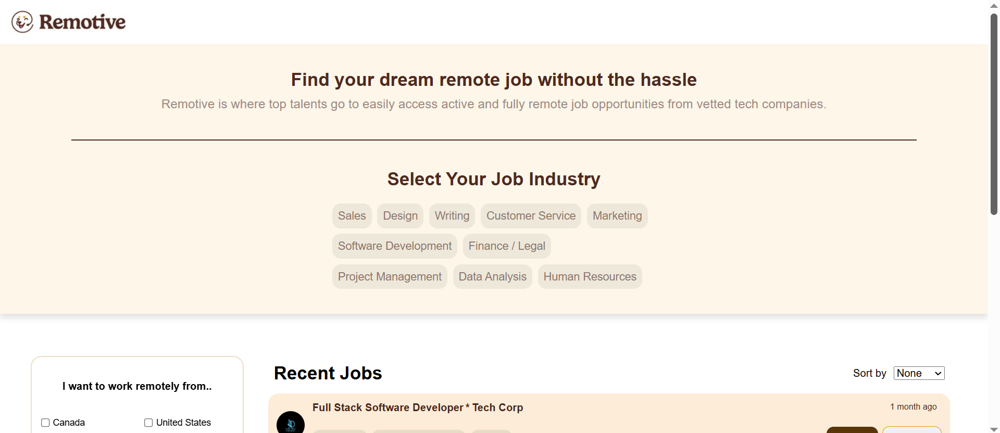
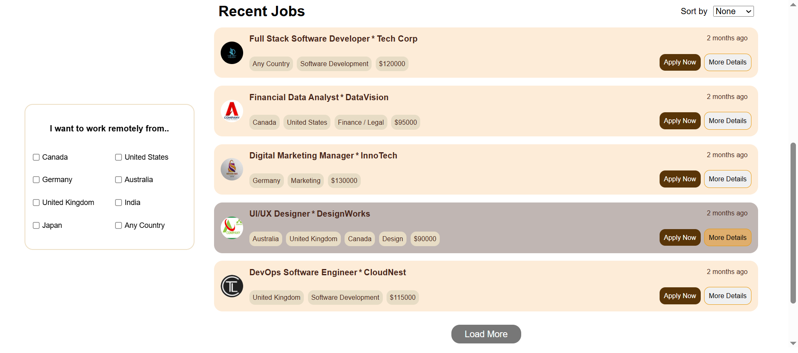
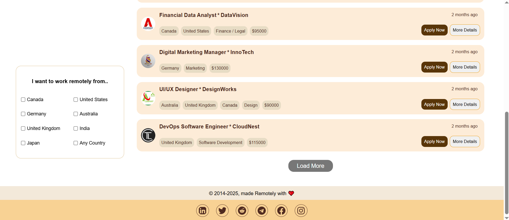
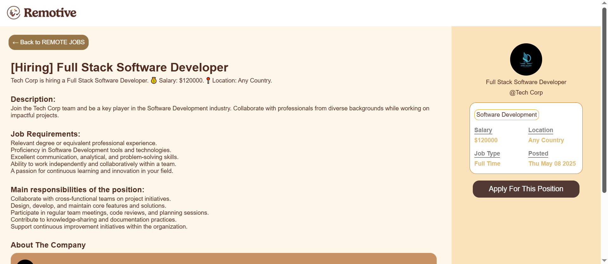
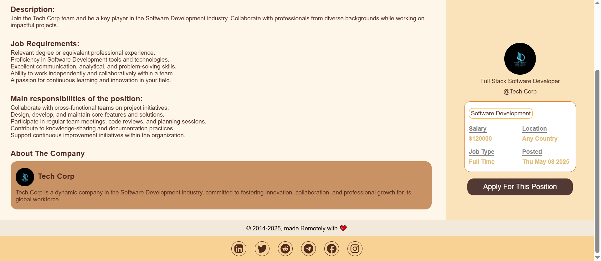
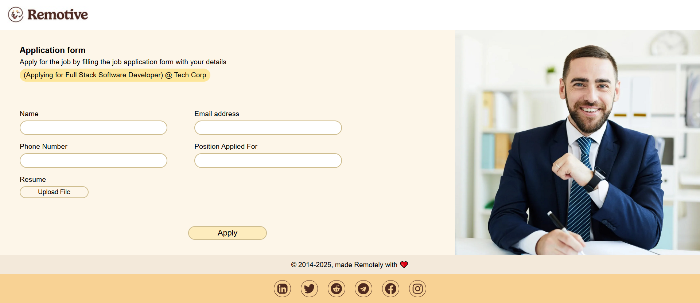

## 📚 Table of Contents

- [Remotive](#remotive-)
- [Live Demo](#-live-demo)
- [Screenshots](#-screenshots)
- [Features](#-features)
- [Tech Stack](#-tech-stack)
- [Getting Started](#-getting-started)
- [About the Author](#about-the-author)

# Remotive 🌍

A job board web app inspired by Remotive, built for discovering and applying to remote jobs across various industries and countries. Users can filter jobs, view detailed descriptions, and simulate applying — all in a fast and intuitive interface.

## 🔗 Live Demo

[Click here to try it](https://remotive-v1.netlify.app/)

## 🖼 Screenshots








## 🚀 Features

- 🌍 Browse a wide selection of **remote jobs**
- 🌎 **Filter jobs by eligible countries** (e.g. "Only USA", "Only EU")
- 🏢 **Filter jobs by industry** such as Tech, Design, Marketing, etc.
- 📄 View **full job details** on a dedicated page
- 💼 **Compact job cards** for quick browsing
- 🧭 **Stateful URLs** — some UI state like selected job is stored in the URL for deep linking and shareable views
- 🧠 Global and remote state management with **Redux Toolkit**
- 📁 **Job data is stored locally in app files** and fetched using `fetch()` to simulate a real server
- ⚡ Built using **React Router v6** for modern routing experience
- 🧼 Handles edge cases (no results, errors) gracefully
- 📱 Fully **responsive design**

## 🛠 Tech Stack

- **React 19** – Frontend UI library
- **React Router DOM v6+** – Modern client-side routing
- **Redux Toolkit** – Global and async state management
- **React Redux** – React bindings for Redux
- **date-fns** – Date formatting utility
- **React Icons** – Icon library
- **Local JSON as Data Source** – Data is stored in local `.json` files and accessed via `fetch()` as if from an API
- **CSS Modules** – Locally scoped styling
- **Vite** – Fast build tool and dev environment
- **ESLint** – Linting and code quality

## 🛠 Getting Started

To run the project locally:

```bash
# 1. Clone the repository
git clone https://github.com/your-username/remotive-clone.git

# 2. Navigate to the project folder
cd remotive-clone

# 3. Install dependencies
npm install

# 4. Start the development server
npm run dev
```

## About the Author

I'm Omar Samir, a frontend developer passionate about building interactive web experiences.

- [LinkedIn](https://www.linkedin.com/in/omarsamir1/)
- Gmail : [omarsamir19971@gmail.com](mailto:omarsamir19971@gmail.com)
- [GitHub](https://github.com/omar-samir-1)
